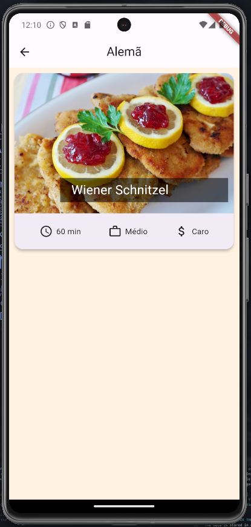
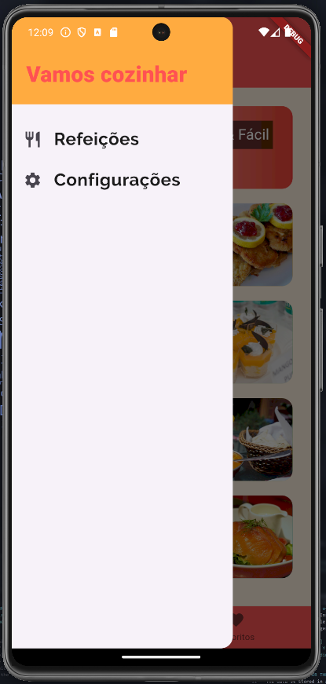
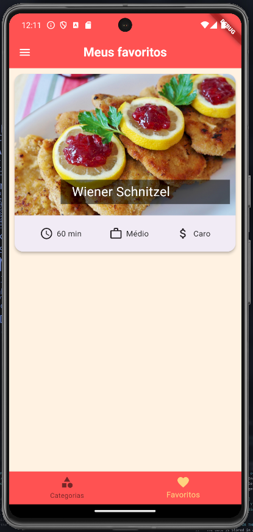
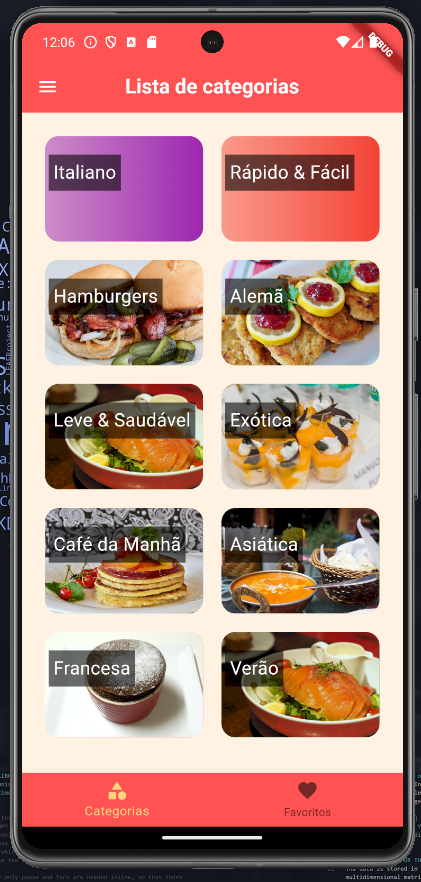
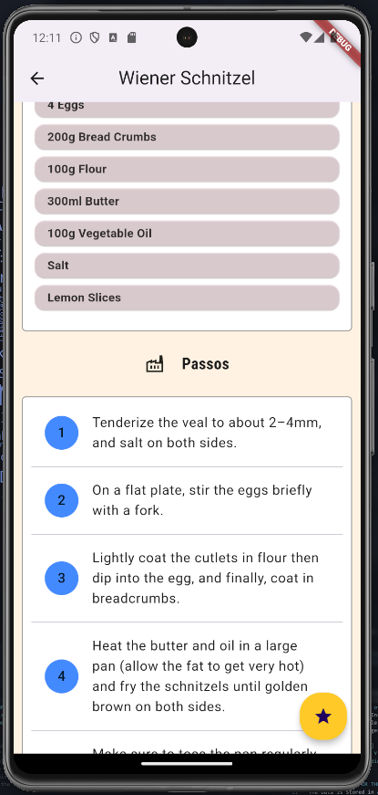
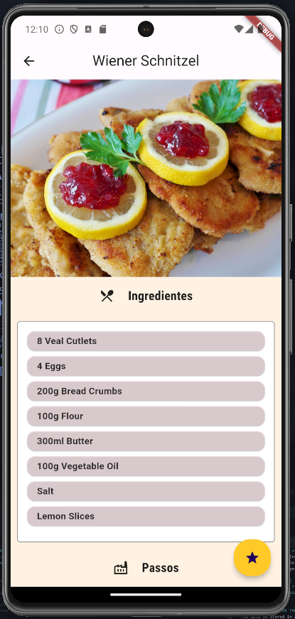
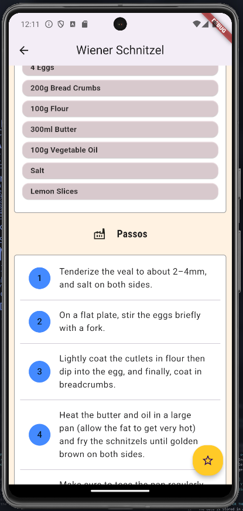

# Shop Flutter App

- A small meal project written in Flutter.
- Without state manager
- using dummy data

 

## Screens

### Category Meals

### Settings

### Favorites

### Home

### Meal Details #1

### Meal's Steps

### Meal After Favorited

